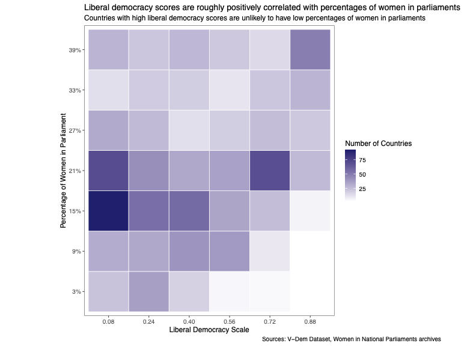
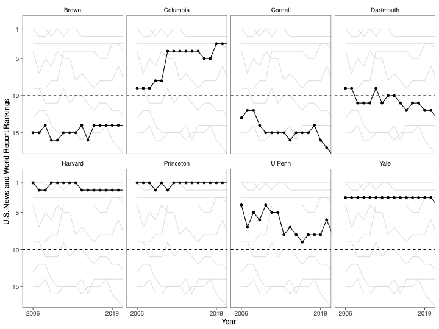
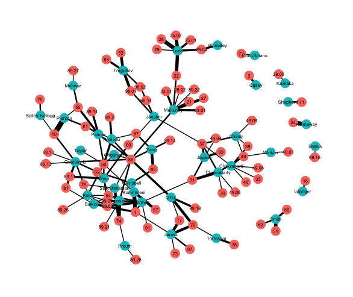

# Portfolio of data work 

# Data visualizations 

## QSS 17: 
### Women in parliaments v.s. liberal democracy scale 
Data partially scraped from internet, cleaned, transformed, and visualized. 

### Rankings of Ivy League universities over time
Data transformed and visualized. 

# Network Visualizations

## QSS 41: 
### Bipartite network of Dartmouth CS professors and classes taught 
Data manually compiled, network visualized, and analyzed. 

# Web scraping: 

### Research project, 21X - Studying impact of 2016 Indian demonetization 
Part 1: scrape text from a database Dartmouth subscribes to, store relevant article text, [script here](code/newsbank.py). Nearly get Dartmouth IP-banned from Newsbank, learn a lot about polite webscraping, switch to using ProQuest TDM Studio. 
Part 2: Jupyter Notebook in ProQuest TDM, analyze ~50,000 XML files to get relevant text excerpts for the project. [Writeup here.](Demonetization Proquest Writeup.pdf). [Results here.](scraping_results.csv)

### Research project, 22W (IN PROGRESS)
Goal: scrape [this website](https://agcensus.dacnet.nic.in/TalukCharacteristics.aspx) to automate the process of getting agricultural census data from HTML tables. Ongoing project - currently writing script that doesn't require Selenium to get data, uses packages requests, BeautifulSoup. 

https://github.com/mjren23/crop_scraping 
